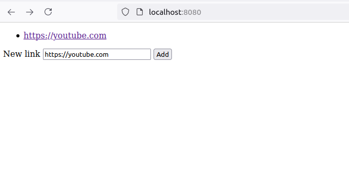

# Motivation

Since telegram was my messenger of choice and had web-version it was very convenient to use it in my smart TV for links sharing.
Like in case I need to watch a movie or something.

However, after recently either telegram stopped supporting Tizen browser or vice versa it became impossible.

This is a small actix (could be anything else, I am just learning it right now) server which just stores a list of strings (which are supposed to be URLs) and displays them.
After it's started, anyone who is connected to the same network can open the webpage and add some links.
Then I just open this page in my smart TV which stores the list of the links. That's all.

# Setup and run

```shell
git clone https://github.com/franza/share-me.git
cd share-me
cargo run
```

# How it looks like

Pretty ugly



